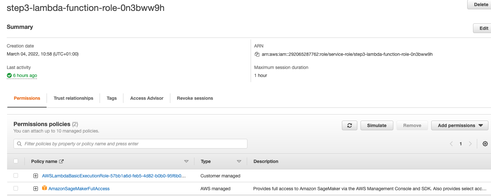

## Notebook initial setup
Before you run these files, you'll have to create and open a Sagemaker instance. Decide which type of Sagemaker instance you should create for your training and deployment. Consider the cost, computing power, and speed of launching for each instance type. Write a short justification of why you chose the instance type you did. After you launch your Sagemaker instance, take a screenshot of your Sagemaker dashboard's Notebooks > Instances section to show what you've done.

### Instance selection
Since there wasn't any specific performance requirements, decided to start with small instance ml.t2.medium to save money during experementation phase. In case if there are some 
performance issues will be detected, migrate to bigger instance.

During experimentation and notebook preparation didn't find any issues, since most trainings was done on external instances with the help of training jobs.

### Notebook instance screenshot


### Training and Deployment

 
### Multi-instance training


## EC2 Training
### Justfication about EC2 instance chooise
For this task EC2 instance for DeepLearning was selected with preinstalled PyTorch "Deep Learning AMI GPU PyTorch 1.10.0 (Amazon Linux 2)". Since there are no special requrements to perfomance decided to take small instance for this task "t2.medium". This choise help to reduce costs during experimentation phase. In case if this instance won't be enough we always can swithc to bigger instance.

### EC2 code and step 1 code comparison
On EC2 instance SageMaker don't used hence we not able to use SageMaker dependencies for estimators like `PyTorch`, `HyperparameterTuner` and SageMaker Debugger. Hence we have to use scripts directly without SageMaker helper classes.

## Lambda function setup


After lambda creation there wasn't enough permissions, hence SageMaker permission was added to lambda role. The main responsibility of this lambda function it to invoke SageMaker endpoint and get prediction result. As soon as result get preprocess it and return as JSON response.

Test event was created to test lambda function in AWS console.

```
{
  "url": "https://s3.amazonaws.com/cdn-origin-etr.akc.org/wp-content/uploads/2017/11/20113314/Carolina-Dog-standing-outdoors.jpg"
}
```

## Security and testing
In order to give lambda required permissions to invoke SageMaker endpoint. To lambda role `step3-lambda-function-role-0n3bww9h` permission `AmazonSageMakerFullAccess` was added.

### Lambda execution result


### Potential security issues


In this case pontentiall security issue are following:
 - lambda has full access to SageMaker
 - lambda placed in public subnet of default VPC

#### Full SageMaker access
According to AWS least privilege principle it's recommended to give lambda only permissions required to do their job, in our case it's invoke SageMaker endpoint. For the sake of simplicity in this example `AmazonSageMakerFullAccess` permission was used which is not best security practice. Since managed AWS policies not present to limit permissons only to invoke endpoint, custom policy need to be created in this case.

#### Lambda in public subnet
//TODO

## Concurrency and auto-scaling


Following types of concurrency was used:
 - provisioned
 - reserved
 
### Provisioned concurrency
Provisioned concurrency was set to 1 lambda. It make sense for this case since there is no frequent invications and most users will not faced with lambda cold start. For production more sophisticated policies can be used. For example target tracking where we scale provisioned concurrency when for example 70% of already scaled lambdas in use. Also on prod we can keep more provisioned lambdas for example minimum 10 (exact numbers depends on load).

## Reserved concurrency
Reserved concurrency was set to 10 lambdas. This requred to reserve 10 lambdas for this particular task, it might be usefull especially in account where a lot of other lambdas used to avoid throttling if for example other lambdas consume free capacity. But this approach has downsides because we have to monitor lambda throttling in case when load increased and 10 lambdas won't be enough. 

## Endpoint auto-scaling


For project endpoint following autoscaling configuration was used:
 - min instance count - 1
 - max instance count - 3
 - scale in cooldown - 60
 - scale out cooldown - 60
 - target value - 70

For this project min instance was set to 1 and max to 3 because we don't expect hight load and don't want that due to some error to many instances was launced. Cooldown period was decreased to 60 seconds to have an ability to test auto-scaling easily (need to wait less time to trigger auto-scaling). For production instance counts and cooldown periods shoud to be set according to existing load. For example if we had hight load and frequent changes in load we have to set more instances to min section and lower cooldown period. For case if we had high load and not frequent changes we can keep cooldown period to 300 seconds. Target value set to 70 which is enough for this case and mayabe for prod have to be set to 50 if hade more aggressibe load.